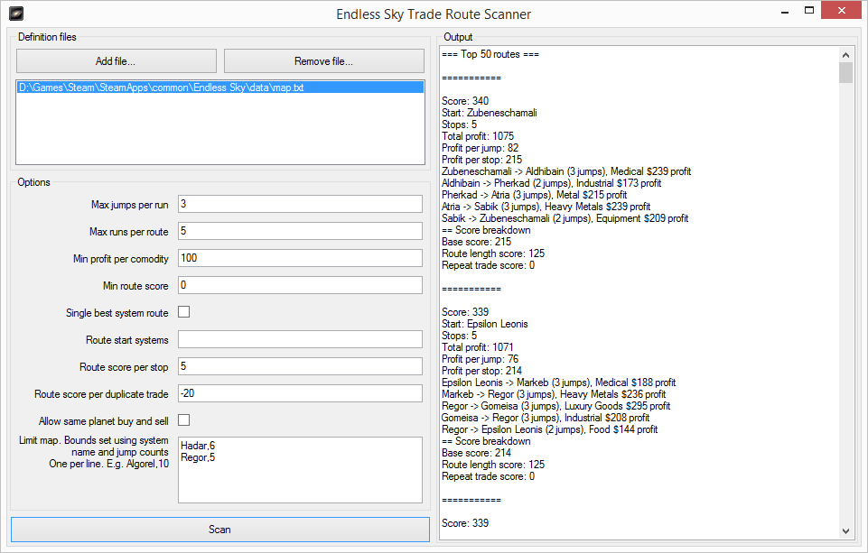

# EndlessSky.TradeRouteScanner
A tool for reading Endless Sky game defs and looking for good trade routes.

It works by reading the Endless Sky data files, specifically the galaxy map with systems and planets, then looking for profitable trade runs between systems, and then looks for profitable routes (or chains of trade runs) that start and end in the same system.

## Requirements
- .Net Framework 4.7.2

## How to use it
1. Add the Endless Sky data files. If you don't have any mods, just add `/Endless Sky/data/map.txt`.
2. Limit the map using the "Limit map" field. On each line, add a system's name and the jump range from the system. If you don't do this, it will scan the whole galaxy, and will take a stupidly long time.
3. (Optional) specifiy the system(s) that you want the trade routes to start from by adding system names to "Route start systems", separated by commas.
4. Click on "Scan".

## Scoring & mechanics
### No duplicate routes
The route scanner will ignore any trade routes that are the same route but start from different planets.

E.g. `Algorel -> Atria -> Sabik -> Algorel` is the same as `Atria -> Sabik -> Algorel -> Atria`

### Prevent Same Stop Buy / Sell
By default, trade route runs where the same comodity is sold and bought are ignored. I think they're useless and a waste of time.

E.g. Land at Algorel, sell food, buy food, take off.

### Route score per stop
By default, longer trade routes and preferred over shorter trade routes. This is because the buying and selling prices change in Endless Sky as you trade, so a longer trade route gives those systems time to recover.

A positive number adds preference to longer trade routes, a negative number adds preference to shorter trade routes.

### Route score per duplicate trade
By default, routes are penalised if they either sell the same comodity to the same place multiple times or buy the same comodity from the same place multiple times.

Multiple duplicates incur multiple penalities.

### Single route per start system
You can instruct the scanner to only return the most profitable trade route for a start system. This works well when scanning across multiple start systems.
